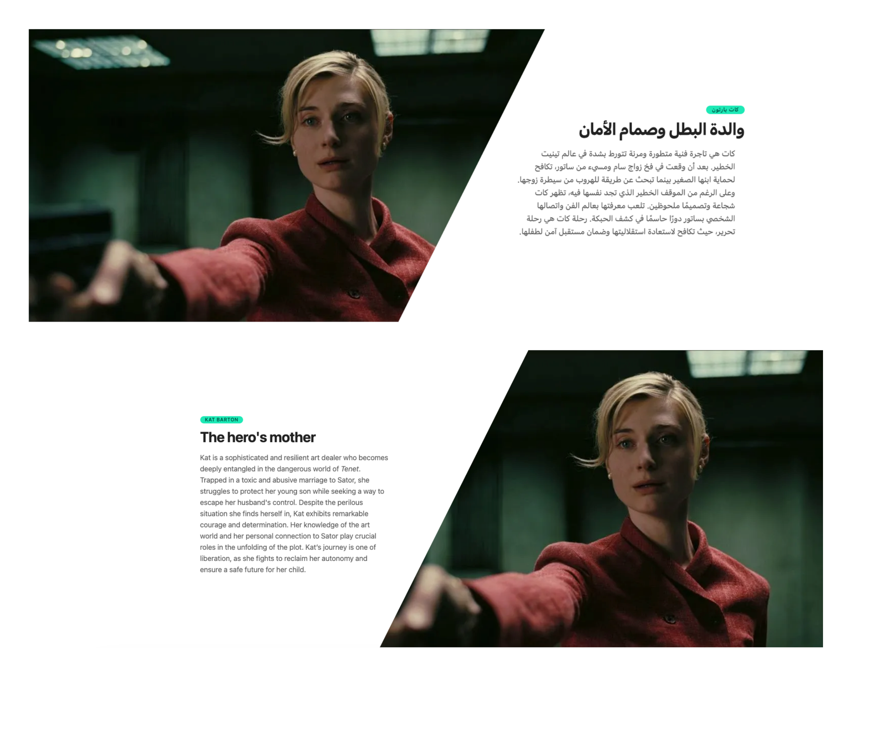
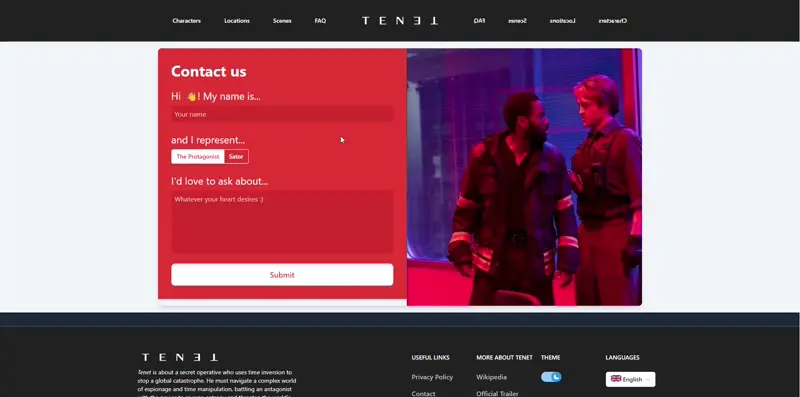
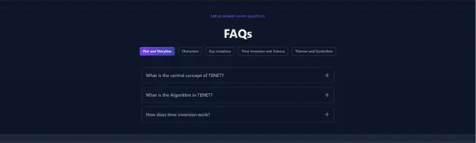
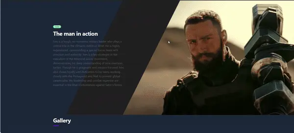

# TENET Jahia Prepackaged Website


A prepackaged ready to use website to use under Jahia 8.2+, GraalVM installation

## Requirements 
- **Jahia 8.2** (Docker or local installation)
- **GraalVM 17** installed and used as your JDK (not required if you use the latest Jahia Docker image as it is already embedded) 
- **TENET templateSet** module installed. Sources can be found here : (https://github.com/GladTek/10n01)

**To build the project**

```
mvn clean install
```

**To deploy it**

```
    mvn jahia:deploy -P${yourMavenProfile}
```

**OR** 

import the jar module under target folder manually : 

**http://${yourserverName}:${yourPortNumber}/jahia/administration/manageModules**

**https://${yourserverName}/jahia/administration/manageModules**

Example :
**http://localhost:8080/jahia/administration/manageModules**


## What you will get :  

A prepared website with content about TENET movie, characters, scenes, locations

Made in two languages to showcase **i18n** and **l10n** : Arabic and English 



Usage of Client Components.







